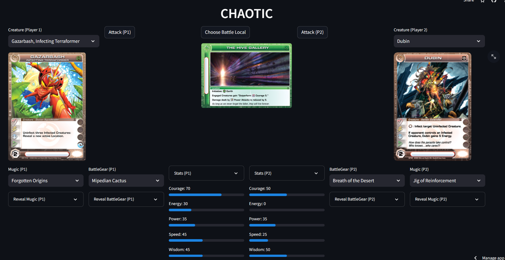

# Chaotic

_O repositório mais saudosista do Github!_



## Construção

Foram utilizadas as bibliotecas requests e bs4 para [Scrapping das URLs](scrapping.py), [Dados](stats.py) e [Download das Imagens](images.py). O gerenciador da plataforma está em [Drome](drome.py) e o jogo está disposto no [Streamlit](app.py). Infelizmente ainda é necessário papel e caneta.

## Alterações

Algumas mudanças foram realizadas para permitir a gameplay:

1. O flush agora é no mode roleta russa;
2. Apenas uma criatura por vez.

## Gameplay

#### Dractyl vs Malvadine nos Trópicos Mipedian

Dractyl equipado com phoenix belt - (-10) se sacrificado
Malvadine equipado com liquilizer - "Água"

1. Malvadine toma a iniciativa e causa (-5) com smartsmack;
2. Malvadine causa (-10) com liquescente swirl;
3. Dractyl revida com dexterous storm (-5) e ganha "Ar";
4. Malvadine usa megaroar e causa (-10);
5. Dractyl usa blind eyes e causa (-10);
6. Malvadine usa sink scream e zera toda a sabedoria de Dractyl;
7. Dractyl ataca com extinguishing fountain e causa (-5);
8. Dractyl ataca com gravity slam e causa (-5);
9. Malvadine ataca com vine snare (-5);
10. Dractyl ataca com minor roar e causa (-10) - com efeito de "Ar"
9. Malvadine vence (-10);

## Regras

#### Tipos de Cartas

**Ataque**: _Estas são suas cartas de ação ou comando. Eles estão no seu baralho principal, onde você pode ter 20 cartas. Depois de usá-los, você pode reciclar seus cartões usados. Você sempre tem 2 cartas de ataque em mãos, então sempre pode escolher o que jogar._

**Criatura**: _Suas cartas de monstro ou personagem. Estas são as cartas com as quais você joga, cada uma delas com habilidades diferentes. Nenhum deles é igual, pois todos têm estatísticas diferentes e um código exclusivo de 12 dígitos. O valor padrão é 3, mas você pode ter 1, 6, 10, 15 ou 21 em seu baralho de criaturas. Você sempre tem a mesma quantidade que seu oponente e sempre a mesma quantidade de Mugic._

```
Tipos de Criatura: 
Única: Você não pode ter outra carta com o mesmo nome de uma carta Única em seu baralho.
Leal: Você só pode incluir Criaturas da mesma Tribo como uma carta Leal no mesmo baralho daquela carta.
Lendário: Você só pode ter uma carta Lendária em todo o seu baralho.
```

**BattleGear (Equipamentos de Batalha)**: _Equipamentos trazem melhorias nos status das criaturas e podem gerar efeitos diversos quando usados. Deve ser equipado 1 item por criatura._

**Localização**: _Áreas especiais que também oferecem habilidades ou desvantagens aos personagens. Eles podem ser reutilizados. Na série de TV, alguns Locais possuem propriedades únicas que advêm de certos aspectos de suas criações ou alterações. Você sempre tem 10 em seu baralho._

**Mugix**: _Cartas especiais que executam uma ação a custo de 1 uso de mugic da criatura. Seu uso depende da disponibilidade de mugix por criatura. Os mugix podem executar façanhas diversas e podem ser de uso genérico ou não._

#### Construção dos Baralhos

Os decks consistem no seguinte:

- 1, 3 ou 6 cartas de Criatura (ou potencialmente mais)
- Uma carta de Battlegear por criatura
- Uma carta Mugic por Criatura
- Exatamente 20 cartas de Ataque, cujo custo total de construção não exceda 20
- Exatamente 10 cartões de localização

**Obs**: 

1. _Até 2 cartas com o mesmo nome podem ser incluídas em um baralho._
2. _As habilidades inatas estão sempre ativas. Essas habilidades não listam nenhum requisito._
3. _As habilidades desencadeadas são ativadas em resposta a um evento do jogo. Essas habilidades são geralmente denotadas pela palavra "Quando" ou "Quando". Habilidades desencadeadas especiais incluem Imprudência e Exaustão, que são ativadas em resposta à criatura que está realizando um ataque, e Intimidação e Prova de Elementos, que são ativadas em resposta ao início de um combate._
4. _Habilidades ativadas podem ser ativadas a qualquer momento que você desejar, geralmente por um custo. Maxxor e Chaor, por exemplo, têm habilidades ativadas que custam contadores Mugic para serem usadas.
